# Crude Oil Price Forecasting with GAMs

End-to-end pipeline for forecasting WTI crude oil futures (CL=F) daily closing price using **Generalized Additive Models** (pyGAM). Pulls from four live data sources, engineers ~100 features, selects the most informative subset automatically, and exposes results through an interactive Streamlit dashboard with probabilistic forecasts.

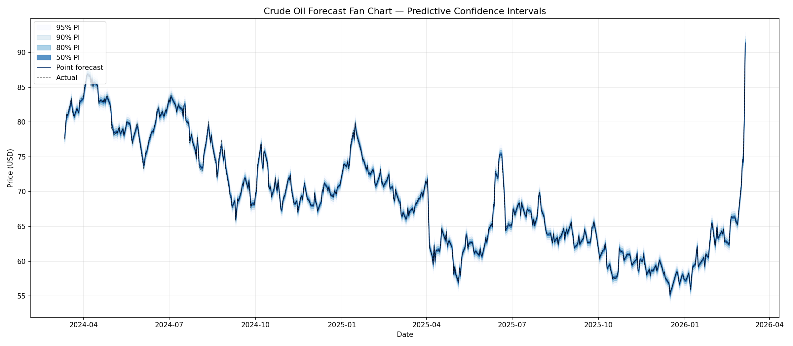

## How it works

The pipeline runs in five sequential stages:

```
Data Acquisition → Feature Engineering → (EDA) → Model Training → Evaluation
```

### Stage 1 — Data Acquisition

Four data sources are downloaded and saved as Parquet files under `data/raw/`:

| Source | What is fetched | File |
|---|---|---|
| Yahoo Finance | WTI (CL=F) + Brent (BZ=F) daily OHLCV | `oil_prices.parquet` |
| Yahoo Finance | ~30 market tickers: energy futures, FX rates, equity ETFs, Treasury yields | `market_tickers.parquet` |
| FRED API | USD index, CPI, Fed Funds rate, 10Y–2Y Treasury spread | `fred_macro.parquet` |
| EIA API v2 | Weekly US crude oil stocks, monthly US production | `eia_crude_stocks.parquet`, `eia_production.parquet` |

### Stage 2 — Feature Engineering

All raw data is merged (EIA weekly/monthly data is forward-filled to daily) and then enriched with 11 feature groups:

| # | Group | What & why |
|---|---|---|
| 1 | **Autoregressive lags** | Target lagged t−1, t−3, t−7, t−30: captures own price momentum |
| 2 | **Macro exogenous lags** | USD index, CPI, Fed Funds, yield spreads lagged 7 & 14 days: macro impact is delayed |
| 3 | **Market lags** | Energy commodities & petrocurrencies lagged 1 & 7 days |
| 4 | **Rolling SMA / EMA / Volatility** | 14, 50, 200-day windows: trend and uncertainty regime |
| 5 | **Bollinger Bands** | 20-day: %B indicator for overbought/oversold positioning |
| 6 | **RSI + MACD** | RSI(14) and MACD(12,26,9): momentum and trend reversal signals |
| 7 | **Price level features** | Distance from MAs, 52-week high/low range position |
| 8 | **Calendar features** | Day-of-week, month, day-of-year, quarter (encoded as cyclic integers) |
| 9 | **Returns** | Daily % and log-returns for crude + all market tickers |
| 10 | **Brent–WTI spread** | Spread, % spread, ratio, 14-day rolling mean/std |
| 11 | **Crack spreads** | Gasoline and heating-oil crack spreads; 3-2-1 refinery benchmark |

The first ~200 rows are dropped as warm-up for the longest rolling windows. The finished dataset is saved to `data/processed/features.parquet` with the raw (unshifted) target — the T+1 forward shift is applied at training time by `build_feature_matrix` in Stage 4, keeping the stored features reusable for any forecast horizon.

### Stage 3 — EDA (optional)

Generates four diagnostic plots in `outputs/figures/`: price history, seasonal decomposition (trend/seasonal/residual), ACF/PACF, and a pairwise correlation heatmap.

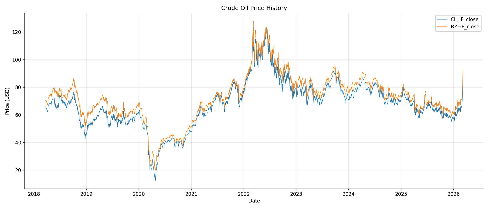

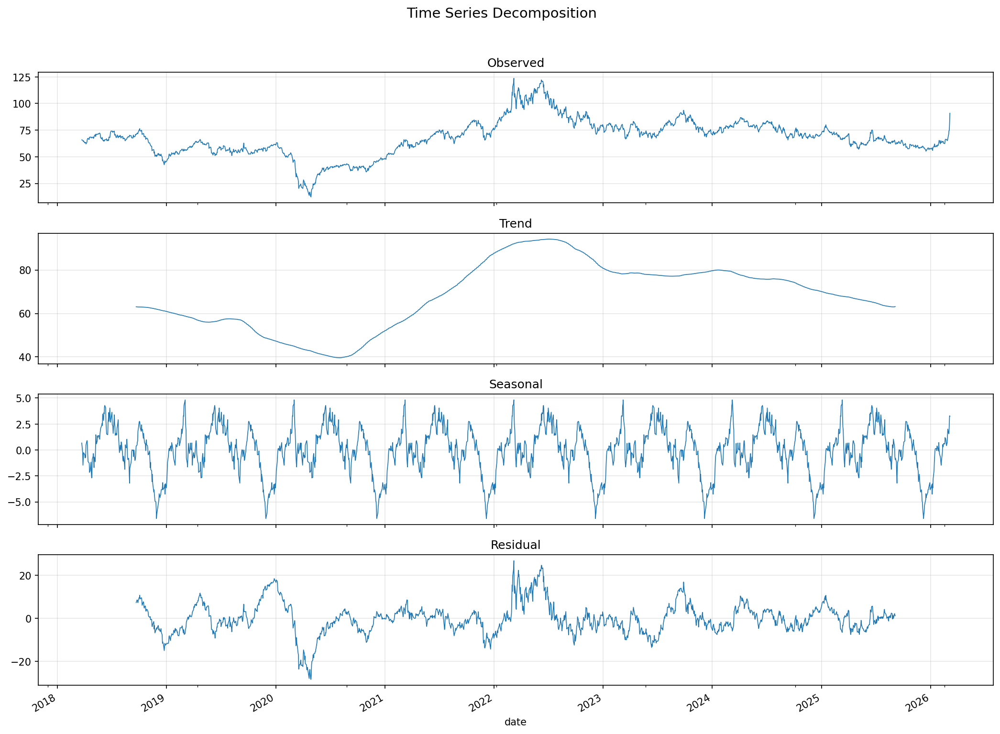

| ACF / PACF | Feature correlation heatmap |
|---|---|
| 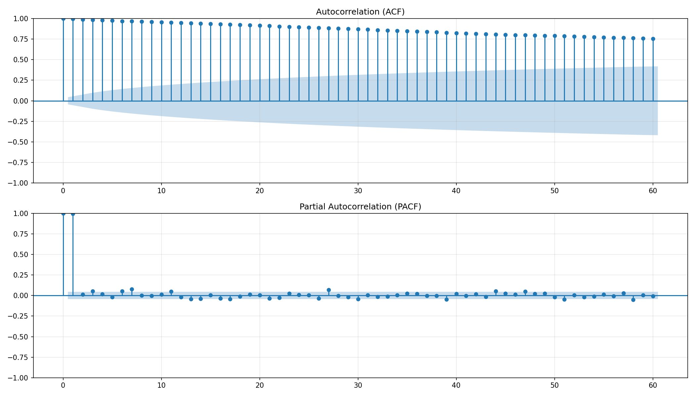 | 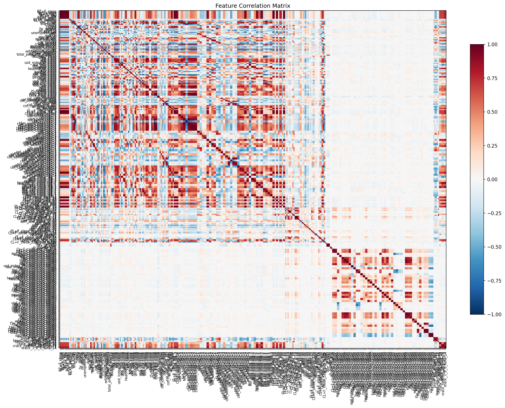 |

### Stage 4 — Model Training

1. **Feature matrix construction** — raw OHLCV columns and non-target close prices are excluded; only engineered derivatives are used. The target is **forward-shifted by 1 trading day** (`forecast_horizon=1`), so each feature row from day *i* predicts the closing price on day *i+1* (genuine next-day forecast).

2. **Stepwise AIC feature selection** (optional, enabled by `stepwise_selection: true` in config) — backward elimination that drops the least significant feature at each step as long as AIC improves. This prunes redundant/correlated features and reduces overfitting.

3. **GAM term assignment** — each remaining feature is assigned a pyGAM term based on its name:
   - Macro indicators → `l()` linear term (expected near-linear effect)
   - Calendar features → `s(basis='cp')` cyclic spline (wraps at year/week boundary)
   - Rolling stats, Bollinger, MACD, RSI → `s(n_splines=25)` spline
   - Lag features → `s(n_splines=20)` spline
   - Returns / log-returns → `s(n_splines=15)` spline

4. **Embargoed time-series cross-validation** — `TimeSeriesSplit` with a 200-day embargo gap. The first 200 observations of each test fold are dropped to prevent the 200-day SMA (computed on the full dataset) from leaking training-period information across fold boundaries. Reports MAE, RMSE, and MAPE per fold.

5. **Final fit** — `LinearGAM` fitted on the full dataset with λ grid-search over `[0.001, 0.01, 0.1, 1, 10, 100]`. Model and feature names are saved to `outputs/models/`.

### Stage 5 — Evaluation

- **Metrics** — GAM vs. naïve baseline (tomorrow = today) on MAE, RMSE, MAPE
- **Johnson SU predictive distribution** — a 4-parameter distribution is fitted to the standardised in-sample residuals, capturing skewness and heavy tails in crude oil returns. This replaces the symmetric Gaussian prediction intervals with asymmetric, fat-tailed intervals.
- **Fan chart** — last 500 trading days with stacked 50/80/90/95% prediction bands
- **Predictive density** — full PDF for the most recent observation
- **Residual diagnostics** — Ljung-Box white-noise test, ACF/PACF of residuals
- **GAM term diagnostics** — smoothing λ and effective degrees of freedom (EDoF) per term

All figures are saved to `outputs/figures/`.

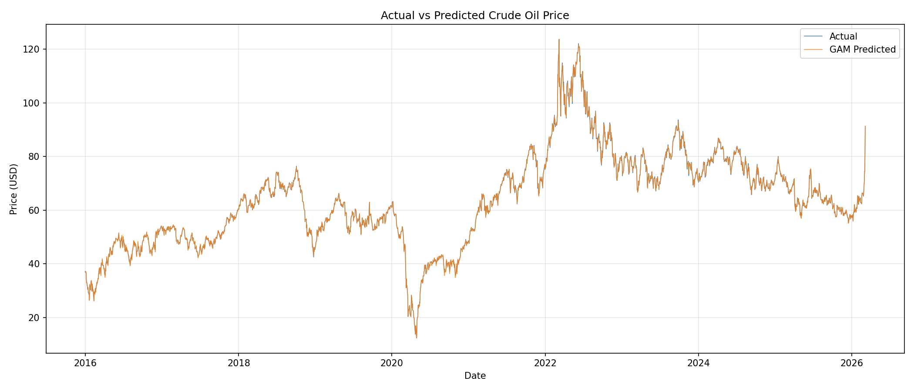


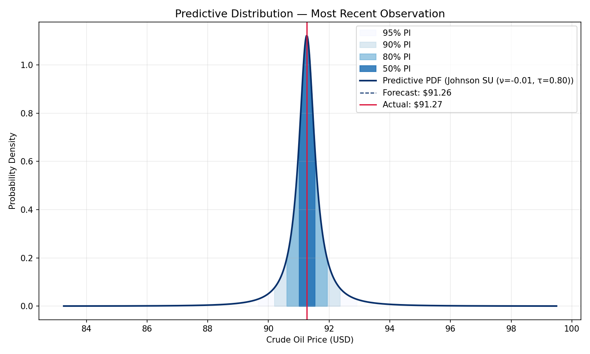

| Residual diagnostics | Residual ACF / PACF |
|---|---|
| 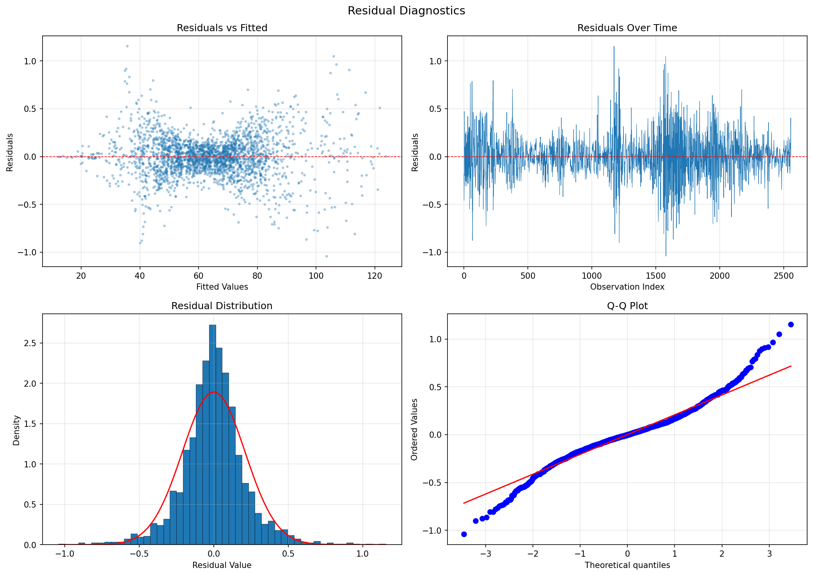 | 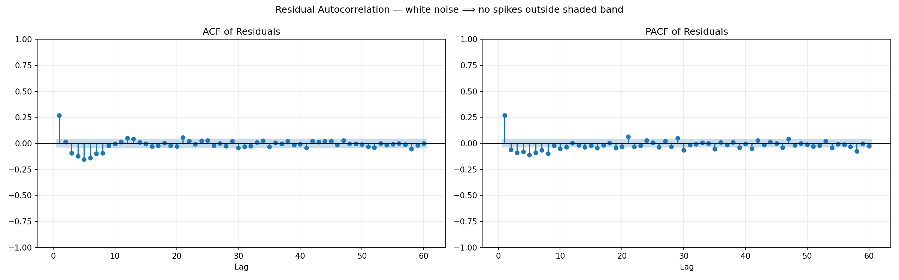 |

| Ljung-Box white-noise test | GAM term diagnostics |
|---|---|
| 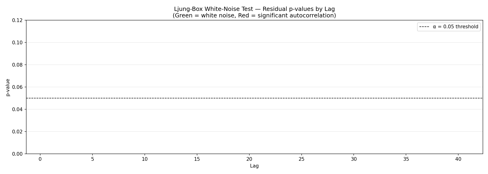 | 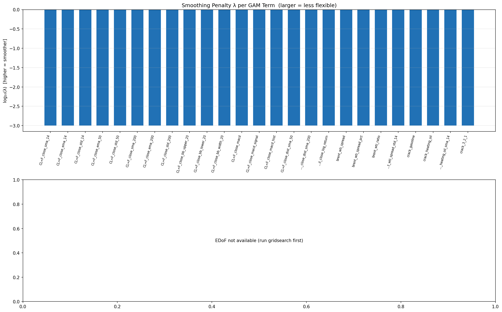 |

### Dashboard

The Streamlit dashboard (`app/dashboard.py`) provides interactive Plotly versions of all charts plus:
- **Partial dependence plots** — the learned shape of each GAM term
- **What-if analysis** — manually adjust feature values and see the impact on the forecast in real time

---

## Prerequisites

- Python 3.11+
- [EIA API key](https://www.eia.gov/opendata/register.php) (free)
- [FRED API key](https://fred.stlouisfed.org/docs/api/api_key.html) (free)

## Setup

```bash
# Clone and enter the project
git clone https://github.com/ferhat00/crude-oil-forecast.git
cd crude-oil-forecast

# Create and activate a virtual environment
python -m venv .venv
source .venv/bin/activate        # macOS / Linux
.venv\Scripts\activate           # Windows

# Install dependencies
pip install -r requirements.txt

# Configure API keys
cp config.example.yaml config.yaml
# Open config.yaml and replace the placeholder values with your EIA and FRED keys
```

Alternatively, API keys can be supplied via environment variables without a `config.yaml`:

```bash
export EIA_API_KEY="your_eia_key"
export FRED_API_KEY="your_fred_key"
```

## Usage

### Run the full pipeline

```bash
python scripts/run_pipeline.py
```

Flags:
- `--skip-download` — skip data acquisition and use existing files in `data/raw/`
- `--skip-eda` — skip EDA plot generation (saves time on re-runs)

### Launch the dashboard

```bash
streamlit run app/dashboard.py
```

The dashboard requires a completed pipeline run (trained model + processed features).

### Run tests

```bash
pytest tests/
```

## Configuration

All behaviour is controlled through `config.yaml`. Key settings:

| Key | Default | Description |
|---|---|---|
| `data.start_date` | `2015-01-01` | Start of the historical data window |
| `data.end_date` | `null` (today) | End date; null fetches up to the current date |
| `features.target` | `CL=F_close` | Column to forecast |
| `features.rolling_windows` | `[14, 50, 200]` | Windows for SMA/EMA/volatility features |
| `model.stepwise_selection` | `true` | Enable backward AIC feature elimination |
| `model.stepwise_max_steps` | `50` | Maximum elimination iterations |
| `model.cv_splits` | `5` | Number of time series CV folds |
| `model.embargo_days` | `200` | Observations removed from each test fold boundary |
| `model.lam_search` | `[0.001…100]` | λ values for GAM smoothing penalty grid search |
| `market_tickers` | ~30 tickers | Currencies, energy futures, equities, ETFs, yield indices |

## Project Structure

```
├── src/
│   ├── config_loader.py      # Config loading, API key resolution, path helpers
│   ├── data_acquisition.py   # Yahoo Finance, FRED, EIA downloaders
│   ├── data_engineering.py   # Merging, all feature groups, build_features()
│   ├── eda.py                # Price history, decomposition, ACF/PACF, correlation
│   ├── model.py              # GAM terms, embargoed CV, stepwise AIC, train_and_save()
│   └── evaluation.py         # Metrics, Johnson SU distribution, all diagnostic plots
├── app/
│   ├── dashboard.py          # Streamlit entry point
│   └── components.py         # Plotly chart builders (fan chart, PD plots, what-if)
├── scripts/
│   └── run_pipeline.py       # End-to-end CLI runner (5 stages)
├── tests/
│   ├── test_data_engineering.py
│   └── test_model.py
├── data/
│   ├── raw/                  # Downloaded parquet files (gitignored)
│   └── processed/            # features.parquet (gitignored)
├── outputs/
│   ├── figures/              # All plots (gitignored)
│   └── models/               # gam_model.pkl + feature_names.pkl (gitignored)
├── config.yaml               # Your API keys and settings (gitignored)
├── config.example.yaml       # Template — copy to config.yaml
└── requirements.txt
```

## License

MIT
